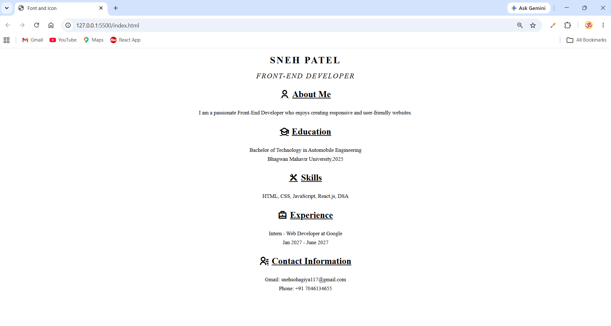

# 📄 Font and Icon Resume

A simple and responsive **Resume Webpage** created using **HTML5**, **CSS3**, and **Remix Icon**. This project demonstrates how to use fonts, icons, external CSS, and basic styling to build a clean personal resume.

---

## 🚀 Features

* Clean and responsive resume layout
* HTML5 structure
* External CSS styling
* Remix Icon integration
* Center-aligned design
* Beginner-friendly code

---

## 🛠️ Technologies Used

* HTML5
* CSS3
* Remix Icon

---

## 📁 Project Structure

```text
Font-and-Icon/
│── index.html
│── css/
│   └── style.css
└── README.md
```

---

## 🎨 Remix Icon

This project uses the **Remix Icon** CDN.

Add the following inside the `<head>` section of your HTML file:

```html
<link href="https://cdn.jsdelivr.net/npm/remixicon@4.9.0/fonts/remixicon.css" rel="stylesheet" />
```

---

## 📋 Resume Sections

* 👤 About Me
* 🎓 Education
* 🛠 Skills
* 💼 Experience
* 📞 Contact Information

---

## 📚 What I Learned

This project helped me practice:

* HTML5 elements
* External CSS
* CSS classes and selectors
* Text formatting
* Letter spacing
* Icons using Remix Icon
* Creating a simple resume webpage

---

## 👨‍💻 Author

**Sneh Patel**

Front-End Developer (Learning)

### Skills

* HTML5
* CSS3
* JavaScript
* React.js
* DSA

---

## Screenshot



## 📄 License

This project is created for educational and learning purposes.

---


