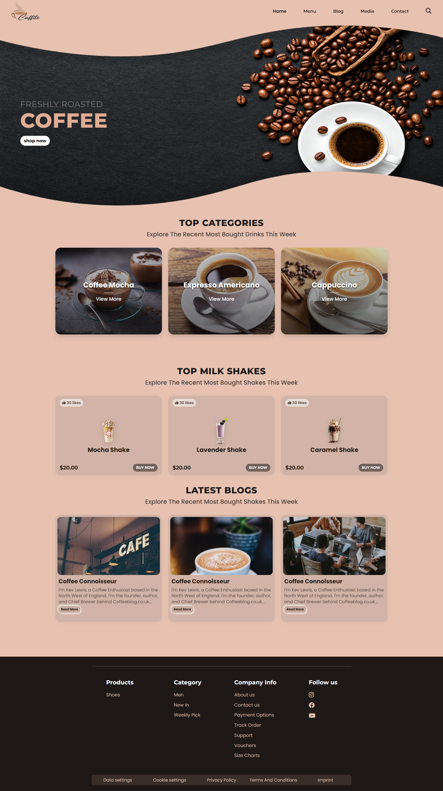

☕ Coffee Website

A modern, responsive coffee-themed front-end website built with HTML5 and CSS3.
The design focuses on a clean coffee-inspired color palette, responsive layouts, product cards, category cards, blog sections, and a structured footer.

Project Type: Front-End Development
Technologies: HTML5 • CSS3 • Font Awesome • Google Fonts
Responsive: Mobile • Tablet • Laptop • Desktop

📸 Website Preview

Desktop View

Note: Place your website screenshot at:
assets/images/screenshot.png

🎥 Website Demo

Project Video

▶️ Watch Website Demo

Replace YOUR_VIDEO_LINK with your GitHub video, Google Drive, YouTube, or other hosted demo link.

If you prefer to keep the video inside the repository, you can use:

## 🎥 Demo Video

https://github.com/YOUR_USERNAME/YOUR_REPOSITORY/assets/YOUR_VIDEO_ID

✨ Features

☕ Coffee-themed modern UI

📱 Fully responsive design

🧭 Responsive navigation bar

🔎 Search icon using Font Awesome

🖼️ Hero banner section

🛍️ Coffee category cards

🥤 Milkshake product cards

❤️ Product likes display

💰 Product pricing

🛒 Buy Now buttons

📰 Latest blog section

🔗 Footer navigation

📱 Social media icons

📜 Legal links section

✨ Hover animations and transitions

🎨 Gradient overlays

📐 CSS Grid and Flexbox layouts

📱 Separate minimum-width and maximum-width media queries

🔤 Google Fonts integration

🖥️ Website Sections

1. Navigation

The header contains:

Logo

Home

Menu

Blog

Media

Contact

Search icon

The HTML loads separate CSS files for the main styling and responsive layouts. fileciteturn1file0L22-L28

2. Hero Section

The hero section features:

FRESHLY ROASTED

COFFEE

with a Shop Now call-to-action button and a large coffee banner. fileciteturn1file0L116-L144

3. Top Categories

The website displays three coffee categories:

Coffee Mocha

Expresso Americano

Cappuccino

Each category uses a large image card with a dark gradient overlay and View More text. fileciteturn1file0L152-L250

4. Top Milk Shakes

The product section contains:

Product

Price

Likes

Mocha Shake

$20.00

30 likes

Lavender Shake

$20.00

30 likes

Caramel Shake

$20.00

30 likes

Each product card includes a product image, likes count, price, and BUY NOW button. fileciteturn1file0L260-L426

5. Latest Blogs

The website includes three coffee blog cards with:

Coffee images

Coffee Connoisseur title

Description

Read More link

fileciteturn1file0L435-L560

6. Footer

The footer contains:

Products

Category

Company Info

Follow Us

Instagram

Facebook

YouTube

Data Settings

Cookie Settings

Privacy Policy

Terms & Conditions

Imprint

fileciteturn1file0L568-L753

🛠️ Technologies Used

HTML5

Used to create the website structure, semantic sections, navigation, product cards, blog cards, and footer.

CSS3

Used for:

Layout

Colors

Typography

Spacing

CSS Grid

Flexbox

Gradients

Shadows

Hover effects

Transitions

Responsive design

Google Fonts

The project uses:

Montserrat

Poppins

Font Awesome

Font Awesome is used for icons such as:

Search

Thumbs Up

Instagram

Facebook

YouTube

The project includes Font Awesome 6.4.0 and Google Fonts in the HTML. fileciteturn1file0L13-L23

📂 Project Structure

coffee-website/
│
├── index.html
│
├── css/
│   ├── style.css
│   ├── min-media.css
│   └── max-media.css
│
├── assets/
│   └── images/
│       ├── logo.png
│       ├── banner.png
│       └── screenshot.png
│
└── README.md

📱 Responsive Breakpoints

The design uses multiple breakpoints to adapt the layout across devices.

Minimum-width breakpoints

480px
576px
768px
992px
1200px
1400px

Maximum-width breakpoints

1199px
991px
767px
575px
479px
360px

The responsive CSS adjusts navigation spacing, hero dimensions, content width, product grids, category layouts, footer columns, typography, and mobile spacing.

🚀 How to Run

1. Clone the repository

git clone https://github.com/YOUR_USERNAME/YOUR_REPOSITORY.git

2. Open the project

cd YOUR_REPOSITORY

3. Open in VS Code

Open the project folder in Visual Studio Code.

4. Run the website

Open index.html directly in your browser, or use the Live Server extension.

📸 How to Add a Screenshot

Take a screenshot of your completed website.

Rename it:

screenshot.png

Put it inside:

assets/images/

The README will display it using:

Recommended screenshot

Use a full-page or desktop screenshot showing:

Navigation

Hero section

Categories

Milkshakes

Blogs

Footer

🎥 How to Add Your Video

Option 1 — GitHub-hosted video

Upload your video to the GitHub repository or GitHub release/assets and add the generated link:

## 🎥 Website Demo

[▶️ Watch Website Demo](YOUR_GITHUB_VIDEO_LINK)

Option 2 — YouTube

## 🎥 Website Demo

[▶️ Watch on YouTube](YOUR_YOUTUBE_LINK)

Option 3 — Google Drive

## 🎥 Website Demo

[▶️ Watch Project Video](YOUR_GOOGLE_DRIVE_LINK)

Recommended video size: Keep the demo video reasonably compressed, preferably around 20–50 MB for a portfolio repository.

🎨 Design Highlights

The website uses a coffee-inspired visual system with:

Warm beige background

Dark brown typography

Rounded cards

Soft shadows

Gradient image overlays

Large hero imagery

Responsive CSS Grid

Flexible footer layouts

Hover animations

📚 What I Practiced

This project demonstrates practical knowledge of:

HTML5 structure

CSS selectors

Box model

Flexbox

CSS Grid

Positioning

Background properties

Gradients

Typography

Google Fonts

Font Awesome

Hover effects

CSS transitions

Responsive design

Media queries

Mobile-first layout adjustments

Component-style class organization

🌐 External Resources

This project uses external resources for fonts, icons, and some website images.

Google Fonts

Font Awesome

Coffee/product image resources

Unsplash images

📌 Project Status

Status: ✅ Completed

Responsive: ✅ Yes

Front-End: ✅ HTML + CSS

Mobile Support: ✅ Yes

Tablet Support: ✅ Yes

Desktop Support: ✅ Yes

📄 License

This project is licensed under the MIT License.

You are free to:

Use the project

Copy the project

Modify the source code

Distribute the project

Use it for personal or commercial purposes

See the LICENSE file for the complete license terms.

👨‍💻 Author

Sneh Patel

Front-End / Full Stack Development Learner

This project was created to practice modern HTML and CSS, responsive layouts, media queries, Flexbox, Grid, UI design, and front-end development.

⭐ Show Your Support

If you found this project useful or interesting:

⭐ Star the repository
🍴 Fork the repository
📢 Share the project

☕ Made with HTML, CSS & Coffee
